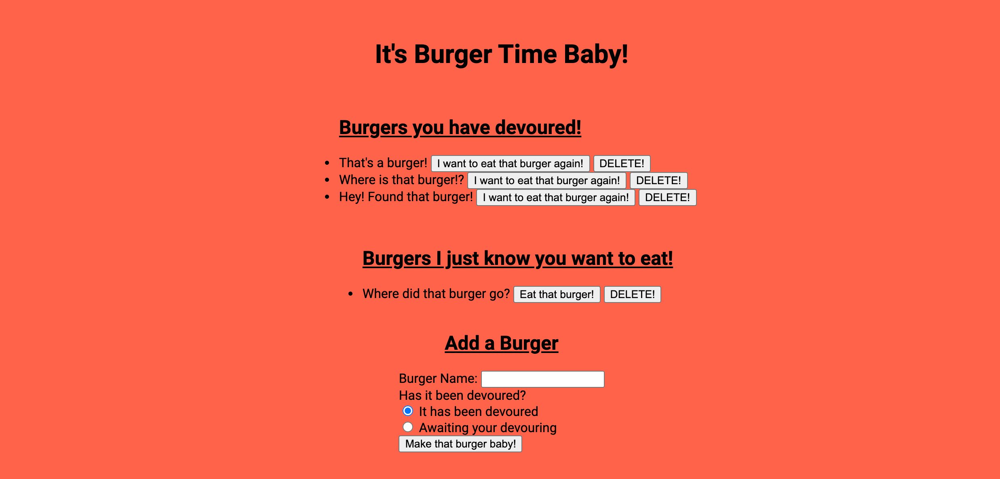

# Burger_Time
Its burger time baby!

  Burger time is a fully interactive web application using node.js with express, handlebars and dotenv npm packages.  This application also uses a mysql database.  For deployment purposes on heroku this site uses jawsDB mysql as the database source.  This application is a fun and simple way to keep track of burgers a user has eaten or burgers a person wants to eat.   
  
  A link to this site is here:  https://young-reef-23127.herokuapp.com/
  
## Instructions on using site:

  The site is pretty self explanitory as long as you follow the cues on and by the buttons.  The screen of the site is seen below in the bright tomato color.  There are a collection of burgers, devoured and not, that are already populating the screen.  Next to the undevoured burgers the user has an oppertunity to either eat the burger or delete the burger.  Similarly next to the burgers that have been devoured there is an option to either have a chance to eat the burger again or delete the burger. It should be noted that once the user deletes the burger the burger is gone and can not be returned to the simulation.  Lastly at the bottom of the page there is an option to create a burger and assign it as either devoured or not devoured.  
  
  

## Folder structure:

* Images
  * burger.png
* config
  * connection.js
  * orm.js
* controllers
  * burgers_controller.js
- db
  - schema.sql
  - seed.sql
-models
  - burgers.js
- public
  - css
    - burger_style.css
  - js
    - index.js
- views
  - layouts
    - main.handlebars
  - partials
    - burger-block.handlebars
  - index.handlebars
- .gitignore
- README.md
- package.json
- server.js

## Technological Support:
  - node.js
  - express.js
  - express-handlebars
  - dotenv
  - mysql
  - jawsDB mysql
 
## Additions:
  If you are intereseted in assisting this code, feel free to clone and make a pull request to the existing code or contact me via email.
    
## Thank you:
  Thank you for checking out my repository.  I look for to any help or criticisms toward the app.
  

